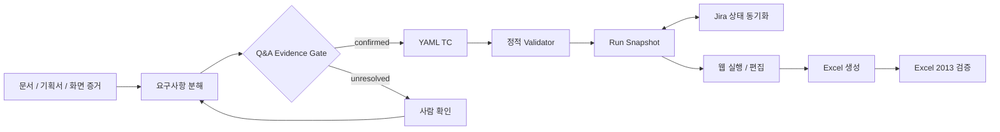

# TC 자동화 발전 기술 회고

> HTML 동기화 대상: [`tc-automation-evolution.html`](tc-automation-evolution.html)
>
> Claude 실행 절차: [`claude-tc-automation-runbook.md`](claude-tc-automation-runbook.md)
>
> 공개 범위: 고객사명, 내부 URL, 계정, Jira 키, 실제 장비 식별자와 원문 데이터는 익명화했다.

## 1-page Summary

### 한 문장 요약

이 작업은 LLM이 TC를 잘 쓰게 만든 과정이 아니라, LLM이 틀려도 제품 범위, 실행 차수, 검증 결과와 최종 산출물이 망가지지 않도록 통제 구조를 만든 과정이다.

### 제로베이스

출발점에는 Claude Code, 사용자 매뉴얼, 릴리즈 노트와 각 담당자가 관리하던 Excel이 있었다. TC 스키마, 문서 권한 체계, 자동 Validator, 실행 차수 모델, Jira 동기화, 웹 편집기와 캐시 무효화 계약은 없었다. 처음에는 문서를 읽고 Excel을 채우면 자동화가 끝날 것으로 봤지만, 실제 실패는 문서 누락, 화면 상태 전이, 제품 범위, 이전 차수 데이터, Excel 렌더링처럼 서로 다른 층에서 발생했다.

### 단계별 전환점

| 단계 | 이전 방식 | 전환점 | 새 통제 장치 |
|---|---|---|---|
| 1. 문서 읽기 | 문단 중심 요약 | 화면과 초기 설정 절차가 누락됨 | 렌더링 이미지 검토, 화면 단위 pre-chunk, 누락 매트릭스 |
| 2. TC 세분화 | 기능 하나를 TC 하나로 작성 | 단일 모델도 열기, 조회, 재조회 혼입 위험이 다름 | 상태 전이와 관찰 지점별 독립 TC |
| 3. 데이터 구조화 | Markdown/Excel이 사실상 원본 | 실행 결과와 정의가 섞이고 재생성이 어려움 | 정책 YAML, TC·사전 조건·데이터셋·suite·run 분리 |
| 4. 실행 차수 | 매 차수 Excel 복사 | 이전 FAIL, 미실행, 변경 TC의 의미가 사라짐 | run snapshot, 결과 승계, PENDING/Not Run/retired 계약 |
| 5. Jira 연동 | 사람이 상태를 다시 입력 | Closed 이슈의 PASS 반영 누락과 오판 | Fix Version 전수 대조, 상태 정책, ETag PUT, 재조회 검증 |
| 6. 웹 운영 | 읽기 전용 카탈로그 | 파일 변경 후 프로세스 캐시가 과거 TC를 노출 | 명시적 invalidate, watcher, last-known-good, stale 가시성 |
| 7. 산출물 | 생성 성공을 완료로 간주 | Excel 앱별 색상·수식·레이아웃 차이 | 구조 검증 후 Excel 2013 실제 열기 Gate |
| 8. 다제품 확장 | 공통 기능이면 한 저장소에 축적 | 제품별 기능·장비·브랜치 경계가 섞임 | 제품별 자산/브랜치/인스턴스 분리, 공통 런타임만 승격 |
| 9. Claude 역할 | 작성 결과를 곧바로 신뢰 | 근거 없는 귀인과 긴 중간 출력 발생 | sanitized read-only review, 기준선 비교, 최종 텍스트만 수용 |

### 현재 아키텍처



핵심 책임은 다음처럼 나뉜다.

- **입력 근거층:** 매뉴얼, 릴리즈 노트, 스크린샷, 코드·심볼의 읽기 전용 증거, 사용자 정정.
- **해석층:** 기능, 상태, 전이, 정상·예외·경계조건을 분해하고 주장을 `confirmed`, `inference`, `recommendation`, `unresolved`로 분류한다.
- **정의층:** 정책과 YAML TC가 권위 원본이며, precondition, dataset, change, suite와 lifecycle을 별도 소유한다.
- **실행층:** run이 특정 시점의 활성 TC를 고정하고 Jira 상태, 결과 승계, 미확인 FAIL과 Not Run을 관리한다.
- **운영층:** 제품별 웹 인스턴스가 편집과 실행을 제공하며 ETag, atomic write, cache invalidation, last-known-good를 적용한다.
- **출력층:** Markdown과 웹은 검토용, Excel은 명시적 요청 때 생성하며 Excel 2013 실제 열기까지 통과해야 최종 산출물이다.

## 증거 연표와 수행 내용

| 시점 | 관찰 또는 사용자 정정 | 수행한 변경 | 남은 자산 |
|---|---|---|---|
| 2026-06-30 | 4~6개 화면을 묶으면 의미가 섞이고 초기 설정, 장비 등록, 모델 선택이 빠진다는 지적 | 원본 DOCX 100쪽을 렌더링하고 이미지와 본문을 함께 읽어 `2.5.x` 화면별 pre-chunk로 재분할 | 문서 권한 인덱스, 화면 단위 pre-chunk, 누락 추적 기준 |
| 2026-07-01 | 단일 모델도 한 TC로 끝낼 수 없다는 정정 | 모든 보고서의 단일 모델 기본 검증을 열기, 데이터 조회, 조건 변경 후 재조회 혼입의 세 TC로 분리 | 상태 전이 중심의 기본 회귀 패턴 |
| 2026-07-03~10 | 첫 릴리즈는 전체 기능 검증이며 WPF 연속 조회와 내보내기 위험을 넓게 봐야 함 | 비동기 완료 역전, 0건 전이, 취소, 오류, 반복 조회, 창 재오픈, 정렬·필터 결과 내보내기 TC 추가 | 첫 제품 TC 묶음과 회사 Excel 생성기 |
| 2026-07-13 | 화면에 보이는 정렬·필터 결과가 아니라 재조회한 데이터가 내보내지던 실제 불편 확인 | 내보내기를 현재 화면 snapshot 계약으로 정의하고 원본 데이터 변경 중 export도 검증 | 화면 상태와 파일 결과의 동일성 Gate |
| 2026-07-14 | 배치 누적 규칙, 편집 권한과 운영 현실에 대한 연속 정정 | run 결과 모델, 명시적 캐시 무효화, ETag, 직접 TC 편집/추가/복제, 파일 기반 정적 토큰 구현 | 공통 데스크톱 실행·작성 웹 Phase 1 |
| 2026-07-23~25 | 같은 Fix Version의 새 차수와 Jira 종결 상태를 안전하게 반영해야 함 | 이전 결과 승계, 변경 TC PENDING, 신규 Not Run, retired 보존, Fix Version 전수 대조와 제안 검증 복구 루프 구현 | run lifecycle과 Jira reconciliation 모듈 |
| 2026-07-27 | 11개 묶음 변경점은 실제 기능 경계를 숨김 | 릴리즈 항목을 29개 기능 경계로 재분할하고 203 TC, 47 dataset까지 보강 | 변경점-영향모듈-TC 추적 구조, 4개 언어 검색 별칭 |
| 2026-07-28~08-14 | Claude의 무응답, 긴 중간 JSON, 잘못된 기준선 귀인이 발생 | 20~30분 대기, 중간 JSON 금지, sanitized read-only packet, base/head 의미 비교와 로컬 재검증 의무화 | Claude review governance와 전용 진입점 |
| 2026-08-13~14 | Jira Closed FAIL의 PASS 후처리 누락, 최종 Excel 앱 차이 발견 | 공통 Jira 조회-판정-ETag PUT-재조회 모듈과 Excel 2013 최종 열기 Gate 도입 | 제품 공통 상태 동기화, 산출물 호환성 기준 |
| 2026-08-18 | 고객사 전용 제품에 존재하지 않는 모듈 TC가 섞였다는 정정 | 잘못된 제품 TC와 전제 조건을 제거하고 제품별 자산 경계를 재검증 | 제품 범위 잠금과 비대상 용어 탐지 규칙 |

## 실패 대응표

| 실수 | 영향 | 탐지 방법 | 재발 방지 장치 |
|---|---|---|---|
| 화면 4~6개를 한 청크로 묶음 | 검색 결과가 여러 기능을 섞고 TC 경계도 커짐 | 목차와 렌더링 화면을 대조해 한 청크에 여러 UI 목적이 있는지 확인 | `2.5.x` 하위 화면을 기본 pre-chunk 경계로 고정 |
| 초기 설정·장비 등록·모델 선택 누락 | 초보 사용자가 테스트 시작 상태를 만들 수 없음 | 원문 heading, 이미지 inventory, 생성 index의 양방향 대조 | source-to-chunk coverage matrix와 누락 Gate |
| 단일 모델을 TC 하나로 처리 | 기본 열기 성공 뒤 재조회 데이터 혼입을 놓침 | 창을 유지한 채 조건을 바꿔 다시 조회 | 열기·조회·갱신 혼입을 독립 기본 TC로 강제 |
| WPF 비동기 조회를 정상 경로만 검증 | 늦게 끝난 이전 요청이 최신 결과를 덮어씀 | 빠른 연속 조회, 0건, 오류, 취소, 창 재오픈 | latest-result-wins와 이전 데이터 비혼입 기대 결과 |
| export가 화면 대신 DB를 재조회 | 사용자가 정렬한 순서와 파일 결과가 달라짐 | 화면 행·순서와 export 파일을 같은 시점에 비교 | visible snapshot export와 source mutation TC |
| 누적 배치 의미를 잘못 해석 | 1차, 2차, 3차 파일의 기대 건수가 틀림 | 실제 사용자 업무 규칙과 생성 파일을 배치별 비교 | 배치별 기대식을 명시하고 사용자 정정을 정책 문서에 승격 |
| 파일은 바뀌었지만 웹은 과거 TC 수 유지 | 실행자가 오래된 TC를 검증 | 파일 revision, catalog loaded time, API count 비교 | write 후 explicit invalidate, watcher, stale 상태와 LKG |
| Jira Closed인데 FAIL이 남음 | 현 차수 결과와 결함 현황이 불일치 | Fix Version 전체 키와 run Jira 키의 합집합 대조 | 공통 상태 정책, ETag PUT, 저장 후 재조회와 diff 보고 |
| Excel 생성 성공만 확인 | 색상, 수식, 유효성 검사, 빈 결과 셀이 앱에서 깨짐 | 최종 앱으로 실제 열어 repair 경고와 두 시트를 시각 검토 | 구조 검사 + Excel 2013 final-open Gate |
| 제품군이 비슷하다는 이유로 기능 범위를 상속 | 존재하지 않는 모듈·VM·장비 전제가 TC에 혼입 | 제품별 release note, 코드 증거, 금지 용어 검색 | 제품/브랜치/자산 root 잠금과 product-scope validator |
| 과거 릴리즈의 패키지 경로·날짜를 승계 | 잘못된 설치 파일과 차수로 TC 생성 | 재귀 파일 탐색 결과와 파일명 날짜 비교 | 릴리즈별 source declaration, 파일명 날짜를 권위로 사용 |
| 정교한 계정 체계를 먼저 설계 | 40명 규모 조직에서 Excel보다 불편한 도구가 됨 | 실제 운영자 수와 기존 업무 흐름 리뷰 | 파일 기반 정적 토큰으로 시작하고 HR 연동은 승격 시점으로 연기 |
| Claude의 분석을 현재 변경의 결함으로 단정 | 기존 데이터 문제를 새 코드 회귀로 오판 | 정확한 base/head와 구조화 diff 재비교 | Claude는 보조 reviewer, 로컬 검증과 disposition 기록이 최종 권위 |
| 긴 JSON·추론 스트리밍을 그대로 수집 | 컨텍스트가 빨리 소진되고 최종 판단이 흐려짐 | 출력량과 timeout 관찰 | 20~30분 대기, 중간 JSON 금지, 최종 텍스트 파일만 수집 |

## 상세 기술 회고

### 1. 첫 실패는 LLM의 문장력이 아니라 입력 경계였다

처음에는 사용자 매뉴얼과 릴리즈 노트를 Claude Code에 읽히고 Excel 양식에 맞게 TC를 쓰면 될 것으로 생각했다. 그러나 이미지가 많은 DOCX는 텍스트 추출만으로 화면 순서와 초기 상태를 복원할 수 없었다. 화면 여러 개를 한 덩어리로 요약하면 검색에는 편해 보였지만, 실제 TC에서는 서로 다른 사전 조건과 성공 기준이 한 항목에 섞였다.

대응은 프롬프트를 길게 쓰는 것이 아니었다. 원본을 보존한 채 문서 전체를 렌더링하고, heading, 페이지 screenshot, embedded image inventory를 함께 대조했다. 이때 RAG용 청크보다 큰 pre-chunk를 먼저 만들고, UI 하위 화면을 의미 경계로 고정했다. 자동화의 첫 스키마는 TC가 아니라 “무엇을 근거로 읽었는가”였다.

### 2. 기능 목록을 상태 전이 모델로 바꿨다

보고서가 열린다는 사실과 올바른 데이터가 조회된다는 사실, 조건을 바꿔도 이전 데이터가 남지 않는다는 사실은 서로 다른 품질 주장이다. 특히 WPF는 창과 ViewModel이 살아 있는 동안 collection, selection, async callback이 남을 수 있다. 그래서 단일 모델 기본 TC도 열기, 조회, 갱신 혼입으로 분리했다.

이후 모든 검색 기능에 다음 전이를 질문했다.

```text
미조회 -> 조회 성공 -> 다른 조건 조회
조회 성공 -> 0건
조회 성공 -> 오류 -> 재시도 성공
요청 A 시작 -> 요청 B 시작 -> B 완료 -> A 늦은 완료
정렬/필터 -> export -> 화면과 파일 비교
창 유지 -> 닫기 -> 재오픈
```

TC 수를 줄이는 것보다 한 TC가 한 가지 실패를 설명하게 하는 편이 실행과 결함 분류에 유리했다.

### 3. Excel을 원본에서 projection으로 내렸다

Excel 셀에 정의, 실행 결과, Jira, 코멘트를 모두 넣으면 사람이 보기에는 익숙하지만 재사용과 변경 추적이 어렵다. 정의를 YAML로 옮기고 precondition, dataset, change, suite, run을 분리했다. Excel은 이 권위 원본에서 생성되는 projection이 됐다.

이 분리는 중요한 효과를 만들었다.

- 같은 TC를 여러 실행 차수에서 재사용할 수 있다.
- 이전 FAIL은 역사로 보존하고 후속 패치의 PASS를 별도로 기록할 수 있다.
- 정의가 바뀐 TC만 PENDING으로 만들 수 있다.
- 제거된 기능은 TC를 삭제하지 않고 retired로 남긴 뒤 신규 run과 Excel에서 N/A로 투영할 수 있다.
- Tester, 상태, Jira 코멘트가 reusable TC 정의를 오염시키지 않는다.

### 4. 웹은 보기 좋은 화면보다 상태 일관성이 먼저였다

정적 카탈로그에서 시작한 웹은 실행 차수 추가, 결과 저장, Jira 링크, TC 편집·추가·복제로 확장됐다. 이때 가장 위험한 문제는 파일 저장 성공 뒤 프로세스 메모리가 과거 catalog를 계속 제공하는 것이었다. 화면의 TC 수가 실제 YAML과 다른 사례가 이를 드러냈다.

공통 런타임은 write 이후 명시적으로 invalidate하고, watcher도 같은 coordinator를 호출한다. 후보 catalog가 검증에 실패하면 현재 서비스 중인 last-known-good를 유지한다. API는 stale 여부와 revision을 노출하고, 쓰기는 ETag와 atomic replace를 사용한다. 즉, “저장했다”가 아니라 “새 revision을 다시 읽었고 사용자 화면도 같은 값을 본다”가 완료다.

### 5. 실행 차수와 Jira는 별도 상태 기계다

새 릴리즈는 Jira Fix Version 변경으로, 같은 릴리즈의 새 검증 차수는 패치 날짜 변경으로 구분했다. 새 run은 생성 순간의 활성 TC ID를 snapshot으로 고정한다. 영향받지 않은 결과는 승계하고, 변경 TC는 PENDING, 새 TC는 Not Run, retired TC는 범위 밖으로 둔다.

Jira 상태는 정의가 아니라 실행 증거다. 공통 후처리는 exact project와 Fix Version의 키 목록을 조회하고, 승인된 우선순위 정책으로 PASS, FAIL, PENDING, POSTPONE을 판정한다. 각 PUT 직전 ETag를 다시 확인하고 저장 후 재조회해 실제 값이 바뀌었는지 검증한다. 이 과정이 빠지면 Closed 이슈가 계속 FAIL로 남거나, 반대로 미실행 TC가 자동 PASS가 될 수 있다.

### 6. 공통화와 제품 격리를 동시에 설계했다

공통화 대상은 schema, validator, web runtime, Jira reconciliation과 Excel 생성 규칙이다. 제품별 릴리즈 노트, TC, 데이터셋, 실행 결과와 장비 전제는 공통화하지 않는다. 제품마다 브랜치, 자산 root와 runtime identity를 분리하고 공통 코드만 의도적으로 이식한다.

제품군의 UI가 비슷하다는 사실은 기능 존재의 증거가 아니다. 실제로 고객사 전용 제품에 없는 모듈이 TC에 들어간 뒤 사용자 정정으로 제거됐다. 그 뒤 제품 범위를 작업 시작 시 잠그고, 비대상 제품 용어를 validator와 검색으로 검사하게 됐다.

### 7. Claude를 작성자에서 독립 reviewer로 재배치했다

Claude Code는 제로베이스에서 빠르게 구조를 만드는 데 유용했지만, 긴 작업에서 무응답처럼 보이거나 중간 JSON이 컨텍스트를 소진했고, 기존 기준선의 문제를 현재 변경 탓으로 잘못 귀인하기도 했다. 이를 해결하기 위해 Claude에게는 제품·브랜치 경계, acceptance criteria, sanitized diff, 권위 문서와 검증 결과만 전달한다.

검토는 20~30분의 충분한 창을 주되 중간 추론이나 JSON을 수집하지 않는다. 최종 finding은 로컬에서 다시 확인하고 `accepted`, `rejected`, `deferred` disposition을 남긴다. Claude는 새로운 관점을 제공하지만 프로젝트의 사실 권위는 문서, 코드, 실제 실행과 사람의 승인에 있다.

## 근거 부록

### 주요 사용자 정정과 제도화 결과

| 사용자 정정 요지 | 즉시 수정 | 제도화된 장치 |
|---|---|---|
| “2.5는 하위 화면 단위가 맞다.” | 청크를 화면별로 재분할 | pre-chunk boundary 규칙 |
| “초기 설정값, 장비 등록, 모델 선택이 빠졌다.” | 누락 chapter 추가 | source coverage matrix |
| “단일 모델도 열기·조회·갱신 혼입으로 나눈다.” | 기본 TC 3분할 | report baseline pattern |
| “다중 모델은 2개, 3개 이상, 월별, 바코드, 조건 변경 재조회가 필요하다.” | 다중 모델 변형과 WPF 예외 TC 추가 | state-transition checklist |
| “내보내기는 현재 화면과 동일해야 한다.” | 정렬·필터·현재 batch snapshot 검증 | screen-to-file consistency Gate |
| “웹의 과거 TC 수는 프로세스 메모리 캐시다.” | instance 재로드와 수동 확인 | explicit invalidation과 stale/LKG |
| “Closed Jira FAIL의 PASS 변경이 왜 빠졌나.” | 누락 결과 후처리 | 공통 Jira reconciliation과 reread verify |
| “최종 XLSX는 Excel 2013으로 연다.” | 최종 앱 검증 기준 변경 | Excel 2013 final-open Gate |
| “고객사 전용 제품에는 해당 모듈이 없다.” | 비대상 TC 제거 | product-scope lock과 금지 용어 검사 |

### 내부 커밋 증거 식별자

아래 짧은 SHA는 비공개 업무 저장소의 감사용 식별자다. 공개 GitHub에서 링크되지는 않으며 고객명과 Jira 키를 제거한 목적만 기록한다.

| SHA | 날짜 | 공개 가능한 의미 |
|---|---|---|
| `7c44e15` | 2026-07-13 | 회사 TC 표기 규칙을 policy와 validator로 고정 |
| `eea3c0a` | 2026-07-14 | 공통 TC 직접 편집·추가·복제와 transactional write 구현 |
| `3f9e243` | 2026-07-23 | 같은 릴리즈의 실행 결과 승계와 미확인 FAIL 가시화 |
| `7c58b00` | 2026-07-25 | 불완전한 LLM 제안을 mutation 전에 복구·차단 |
| `c5568e8` | 2026-07-27 | 기능 경계 재분할 뒤 203 TC와 다국어 검색 별칭 보강 |
| `5780674`, `195ba1c` | 2026-08-13 | 제품 공통 Jira 상태 동기화와 재조회 검증 |
| `6d968b0`, `23e4c58` | 2026-08-14 | Claude read-only review 정책과 권위 문서 진입점 |
| `d432cc5` | 2026-08-18 | 고객사 전용 제품에서 비대상 모듈 TC 제거 |

### 검증 명령과 기록된 결과

```powershell
pnpm tc:quality
pnpm test
pnpm test:e2e
pnpm assets:instances:audit
pnpm runs:jira:sync -- --project <PROJECT> --release <RELEASE> --run <RUN>
```

- 기능 경계 재분할 milestone에서 203 TC, 47 dataset이 strict policy를 오류 0, 경고 0으로 통과했다.
- 웹 authoring E2E는 데스크톱 1440x900에서 edit, create, clone, ETag conflict, result save, stale와 recovery를 검증했고 browser error는 0이었다.
- 다제품 audit는 각 인스턴스의 project identity, definition/run validation과 `stale=false`를 함께 확인하도록 구성했다.
- Jira 동기화는 조회, 정책 판정, ETag PUT, 재조회 결과 비교가 모두 끝나야 성공으로 기록한다.
- 회사 XLSX는 구조 검증 후 Excel 2013에서 repair 또는 compatibility 경고, 수식, 색상, 유효성 검사, Jira, 빈 결과 셀을 직접 확인한다.

## Claude 전용 상세 런북

Claude가 같은 과정을 재현할 때 사용할 실행 순서, 금지사항, stop condition과 handoff 형식은 별도 문서로 고정한다.

- [`Claude TC 자동화 상세 런북`](claude-tc-automation-runbook.md)
